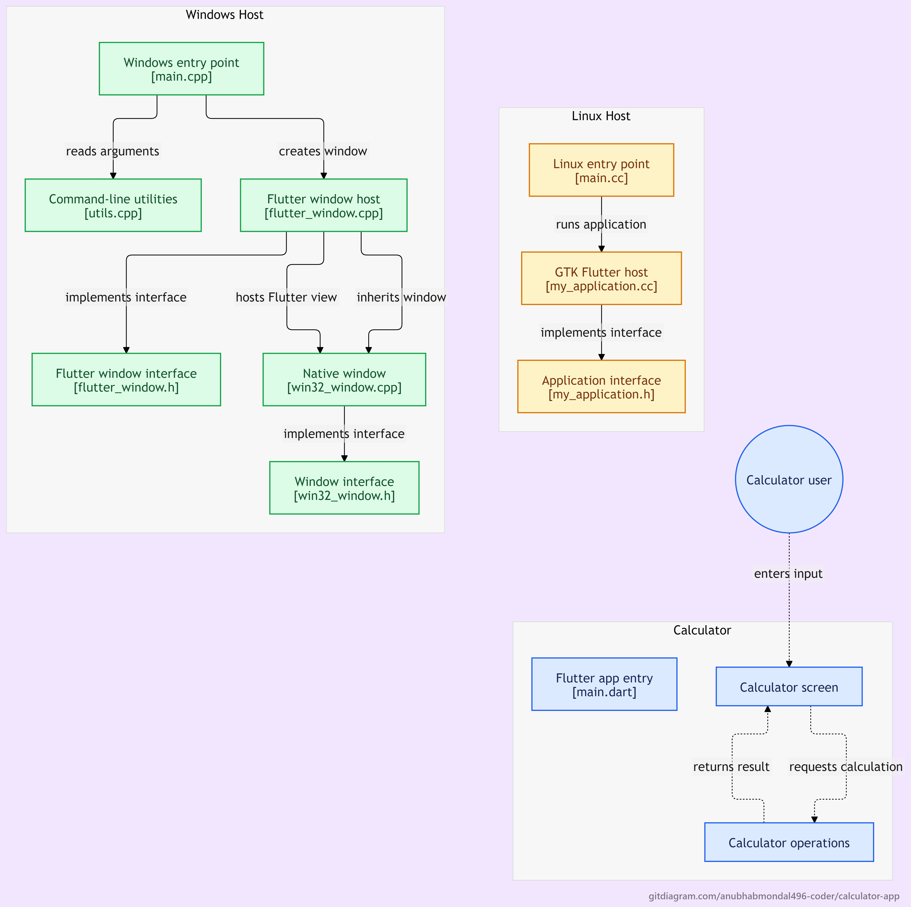

## System Architecture

The following diagram illustrates the architecture and execution flow of the Flutter Calculator application across the Flutter application layer and desktop host platforms

### Architecture Overview
<h2>System Architecture</h2>

<p align="center">
  
</p>

The application consists of three main layers:

1. **Calculator Application**
   - `main.dart` acts as the Flutter application entry point.
   - The Calculator Screen provides the user interface.
   - Calculator operations process the user's input and return the calculated result.

2. **Flutter Platform Host**
   - Flutter provides platform-specific window hosts for desktop environments.
   - On Windows, the Flutter application interacts with the native Windows window implementation.
   - On Linux, the application runs through the GTK Flutter host.

3. **User Interaction**
   - The calculator user enters numbers and mathematical operators through the calculator interface.
   - The calculator screen sends the input to the calculation logic.
   - The calculated result is returned and displayed on the calculator screen.

### Application Flow

```text
User Input
    ↓
Calculator Screen
    ↓
Calculator Operations
    ↓
Calculation Result
    ↓
Calculator Screen

calculator/
├── android/
├── ios/
├── lib/
├── test/
├── web/
├── windows/
├── docs/
│   └── Calculator_diagram.png
├── .gitignore
├── pubspec.yaml
└── README.md

